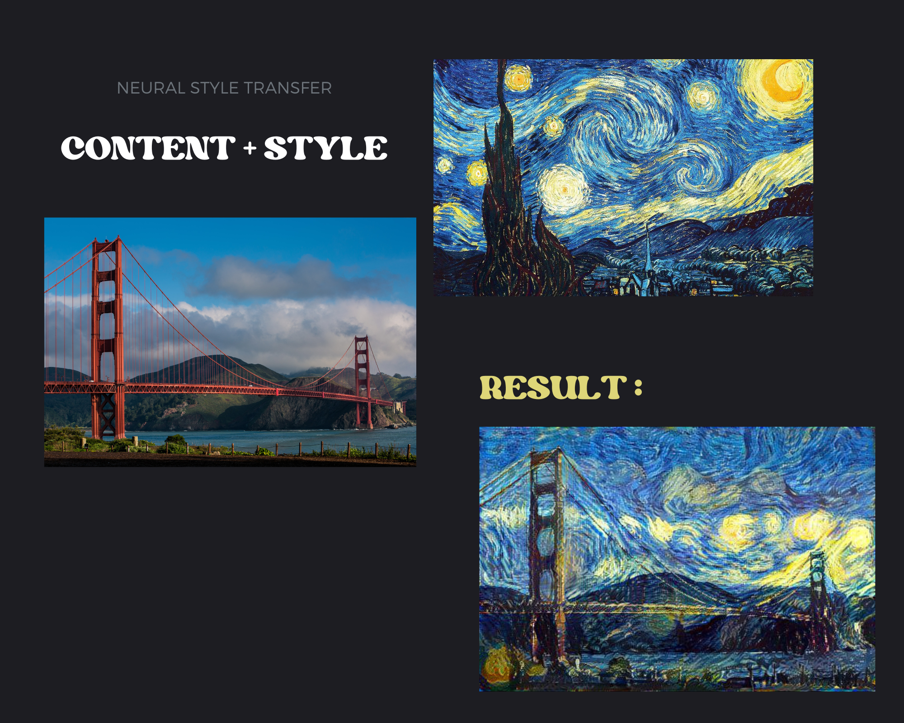

# Neural Style Transfer

## Introduction
Neural Style Transfer is an optimization technique used to take three images, a content image, a style reference image (such as an artwork by a famous painter), and the input image you want to style -- and blend them together such that the input image is transformed to look like the content image, but “painted” in the style of the style image.

## How it works

The principle of Neural Style Transfer (NST) is to define two distance functions, one that describes how different the content of two images are, Lcontent, and one that describes the difference between the two images in terms of their style, Lstyle. Then, given three images, a desired style image, a desired content image, and the input image (initialized with the content image), we try to transform the input image to minimize the content distance with the content image and its style distance with the style image.

## Implementation
The implementation of Neural Style Transfer is done using TensorFlow and Keras. The model used is VGG19, which is a pre-trained image classification model. The model is used to define the content and style representations of our images. These intermediate layers are necessary to define the representation of content and style from our images. For an input image, we try to match the corresponding style and content target representations at these intermediate layers.

## Requirements
* Python: Version 3.8
* Operating System: Ubuntu 20.04 LTS
* Libraries:
    * Numpy (version 1.19.2)
    * TensorFlow (version 2.6)
* Code Style: Pycodestyle (version 2.6.0)

## Usage
1. Place your style image (starry_night.jpg) and content image (golden_gate.jpg) in the project directory.
2. Run the main.py script to perform neural style transfer:
   ```bash
   python main.py
   ```
4. The generated image will be saved as starry_gate2.jpg in the project directory.

  ---
**Notes**
* **Adjusting Parameters**: You can adjust various parameters such as the style and content weights, learning rate, and optimization algorithm
* **Customizing Style and Content Images**: Feel free to experiment with different style and content images to achieve unique artistic effects. Ensure that the images are properly scaled and formatted before running the script.
