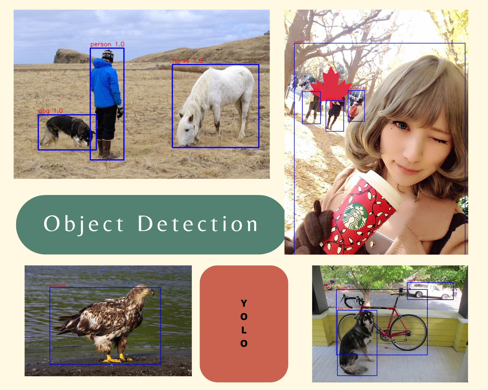

# Object detection

The goal of this project is to detect objects in images and videos. We will use the YOLO v3 algorithm, which is a state-of-the-art, real-time object detection system. The Yolo class provided allows for processing images and detecting objects within them.

## File
- [yolo.h5](https://www.kaggle.com/datasets/rmoharir8396/yolo-h5-file)

## Requierements
- Python 3.5
- TensorFlow version 1.12
- Keras
- Numpy version 1.15

## Usage
Instantiate the Yolo class by providing the model path, classes path, class threshold, NMS threshold, and anchors.
Use the predict method to perform object detection on images within a specified folder.
Optionally, use the show_boxes method to display the detected objects on an image.

## Functions
|Function	|Description |
|---------|-------------|
|`__init__`	|Constructor of the Yolo class, initializing paths to the model and classes, as well as score and non-maximal suppression (NMS) thresholds.|
|`process_outputs`	|Processes YOLO model outputs to extract bounding boxes, box confidences, and class probabilities.|
|`filter_boxes`	|Filters bounding boxes based on their confidence and class rankings, keeping only the most probable boxes.|
|`non_max_suppression`	|Applies non-maximal suppression to eliminate redundant bounding boxes and group them into unique predictions.|
|`load_images`	|Loads images from a specified folder.|
|`preprocess_images`	|Preprocesses images to fit the YOLO model's input format.|
|`show_boxes`	|Displays detected bounding boxes on a given image, with class names and box scores.|
|`predict`	|Performs object detection on images in a specified folder and displays the results.|

---
### Notes
- Ensure that the model and classes files are properly configured and located in the specified paths.
- Adjust the class threshold and NMS threshold for optimal object detection performance.
- Images should be properly formatted and scaled before performing object detection.
